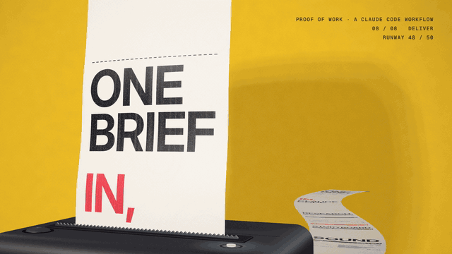
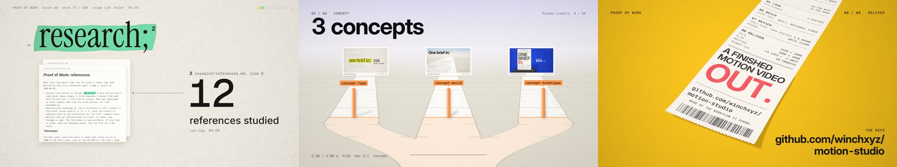
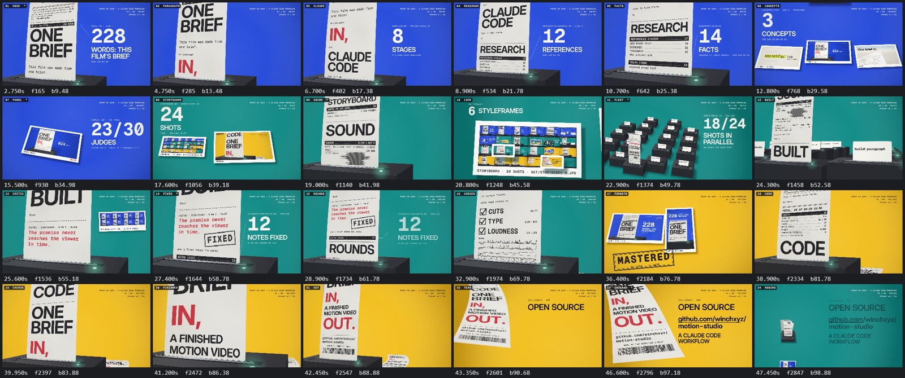
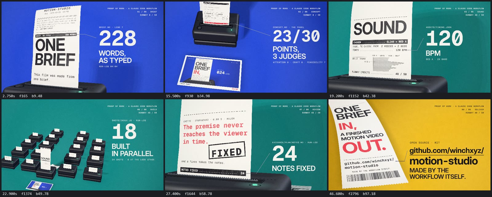
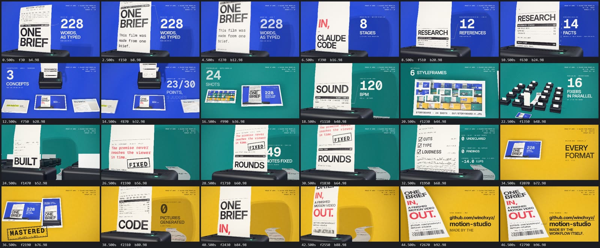
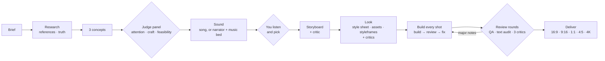
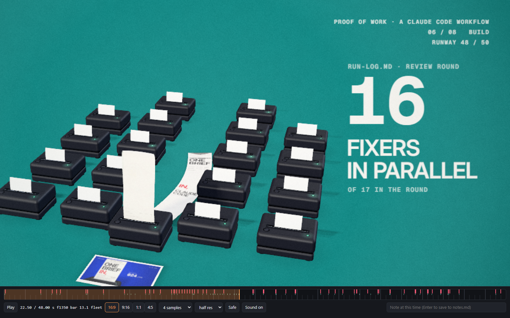
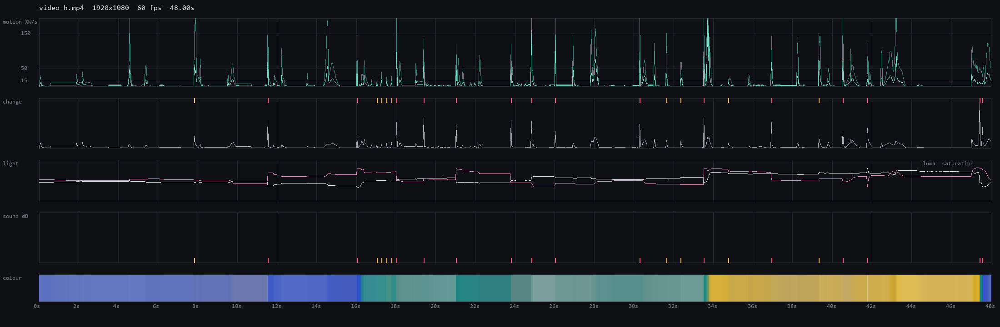

<div align="center">

# motion-studio

**One brief in, a finished motion video out.**
A Claude Code workflow that researches, pitches, scores, storyboards, designs, builds, reviews
and delivers motion videos, with a team of agents and a GPU engine where every frame is code.



**▶ Watch the film it made about itself:** [16:9](https://github.com/winchxyz/motion-studio/releases/download/v0.1.0/proof-of-work-16x9.mp4) ·
[9:16](https://github.com/winchxyz/motion-studio/releases/download/v0.1.0/proof-of-work-9x16.mp4) (48 s, with sound)

[](WORKFLOW.md)
[](https://www.anthropic.com/claude)
[](LICENSE)


</div>

## The film at the top made itself

The brief was one paragraph: a film about this workflow, made by this workflow. Three agents pitched
three concepts with rendered frames, three judges scored them, and **Paper Trail** won (23/30): a
thermal printer prints the record of the film's own run, in time with the narrator.



<sub>The three pitches, as the judges saw them: <b>The Brief, Annotated</b> (20/30), <b>Caret</b> (12/30), <b>Paper Trail</b> (23/30).</sub>

Every number the receipt prints comes from the run's own log: the brief's 228 words, 12 references and
14 checked facts, 23 of 30 points from 3 judges, the sound (a narrator and a music bed picked by ear from
two of each), 24 shots on the grid, 16 fixers working in parallel, 49 critic notes fixed, 0 undeclared
cuts, -14 LUFS, 0 pictures generated.

| Storyboard, timed to the narration | Styleframes, after two critics |
| --- | --- |
|  |  |



## What it is

You write a brief ("a 45-second launch film for our app, in our brand, made to travel on X").
Claude Code runs `.claude/workflows/motion-video.js` and a team of agents takes it from there:



| Stage | Agents | Output |
| --- | --- | --- |
| Brief | setup, references, truth (parallel) | `brief.md`, research with sources |
| Concept | 3 concepts from different angles, 3 judges, a synthesiser | `concept.md` |
| Sound | a song (Runway Lyria), or a narrator (two voices) over a music bed (two beds), timed word by word; the run stops until you have listened and picked | `song.json`, `out/listen-*.mp3` |
| Plan | storyboard on the beat grid, then a critic | `storyboard.md`, `shots/index.js` |
| Look | style sheet, characters, sets, clips, styleframes, 2 critics | `style.js`, `assets/gen/`, stills |
| Build | one builder, reviewer and fixer per shot, in parallel | `shots/*.js` |
| Review | QA + text audit + 3 critics per round, fixers, up to 3 rounds | a clean cut |
| Deliver | all formats, mastered sound, previews, post copy | `out/`, `post.md` |

Details: [WORKFLOW.md](WORKFLOW.md).

## Why the results hold up

- **A written quality bar.** Every agent reads [`motion-craft`](.claude/skills/motion-craft/SKILL.md):
  type scale, motion timing and easing, composition, the social hook, and what never ships
  (placeholder art, default fonts, PowerPoint motion).
- **Independent eyes.** Judges pick the concept; a critic agent that sees only frames reviews the
  storyboard, the styleframes, every shot and the whole film, round after round.
- **Measurements, not only opinions.** `qa.py` finds cuts nobody placed and stretches too fast to
  follow (optical flow); `audit.mjs` checks every piece of text for safe area, size, overlaps and
  reading time; loudness is mastered to -14 LUFS / -1 dBTP.
- **Generated media is a base, not the result.** Runway stills and clips are redrawn in code
  (ink, painterly, riso, halftone, dither) and animated with rigs and JS overlays.
- **You hear it before it's built on.** The run stops after the sound so you can listen to the takes
  (a song, or two narrators over two music beds) and pick; nothing is storyboarded on audio you haven't
  approved.
- **Two tiers of models.** Every agent that makes something (research, storyboard, art, shots, fixes,
  delivery) runs on Claude Sonnet 5.5; the judges and every critic run on Claude Opus 5.5
  (`models: { worker, judge }` to change either).

| The preview player: scrub, beat and edit marks, formats, safe areas, notes | `qa.py` on the final cut: motion, cuts, light, colour |
| --- | --- |
|  |  |

## What it costs

Measured on the film above, at API prices: 46 agents, about $320 and about 17 hours of run time, plus 48
Runway credits (two narrator voices, two music beds, one song). That includes one detour worth about $90
and 5 hours: the first soundtrack was a generated song, and after hearing it we switched to a narrator,
which is why the run now stops for you to listen before anything is built on the sound.

Nearly all of the cost is agents re-reading their own context: a shot builder that looks at its renders
grows to 300-500K tokens and re-reads them on every step. So the workflow keeps agents lean: makers on
Sonnet, short reads, a few render-and-look passes at low samples, one art-prep agent instead of one per
asset, and a build stage you can skip (`from: "review"`) when the storyboard's shots are already
animated, as they were here.

## The engine

Every frame is a pure function of time, drawn with WebGL2 in headless Chrome and piped to ffmpeg
as raw pixels (about 80 ms a frame at 1080p with 12-sample motion blur on a laptop GPU).

- **Layers**: shaders, Canvas 2D, images on a bendable mesh, 3D cards, image sequences (generated
  video), Three.js scenes, groups with masks, transforms and their own looks.
- **Looks**: grade, tritone, halftone, riso, dither (PC-98 palettes), CRT, paper, ink (XDoG line art),
  kuwahara, chroma, glitch slices, pixelate, posterize, lens, grain, vignette, bloom.
- **Type**: kinetic words and letters, typewriter, odometer, slot roller, text on paths, stamps, lyric
  captions (box, karaoke, pop, kinetic), each piece of text audited.
- **Time**: beat grids from a BPM or a song's detected beats, an edit with 11 transition types, cues
  for the sound. Hard cuts are decided per frame, so no frame blends two shots.
- **Rig** for still art: breathing, sway, beat bounce, blinks, a mouth that follows timed lyrics,
  parallax plates, camera shake.
- **3D**: Three.js with extruded type from any TTF, extruded SVG logos, glTF, chrome, glass, clay.
- **Formats**: 16:9, 9:16, 1:1, 4:5 and 4K from one timeline, each laid out on its own; platform safe
  areas for Reels, TikTok and Shorts.
- **Sound**: numpy synthesis (pads, plucks, FM bells, drums, whooshes, risers), a mixer with sends and
  ducking, designed effects on every cut and hit, song analysis (beats, bars, sections, word timing
  with faster-whisper).
- **Preview player**: real-time playback, scrubbing with beat and edit marks, format switch, safe-area
  overlay, and notes typed at a timestamp that land in the film's `notes.md` for the next run.

## Quick start

Requirements: [Claude Code](https://claude.com/claude-code), Node 22+, Python 3.11+, ffmpeg on the PATH,
Google Chrome (or set `CHROME` to a Chromium). Optional: the Runway MCP connector for generated art,
songs and voice.

```bash
git clone https://github.com/winchxyz/motion-studio && cd motion-studio
npm install
pip install -r requirements.txt
```

Open Claude Code in the folder and say:

> Run the motion-video workflow: a 30-second launch film for <product>, their brand, 16:9 and 9:16.

Watch it with `/workflows`. The run stops after the sound for you to listen: say which take and it
continues from the storyboard. Add "stop at the look" to approve the styleframes before the build.
Everything also works by hand:

```bash
node studio/tools/new-film.mjs my-film --template spot         # or music-video
node studio/tools/serve.mjs                                     # preview at /studio/engine/preview.html?film=/my-film
node studio/tools/render.mjs my-film --sheet 0:30:0.5 --cols 8 --tw 320
node studio/tools/render.mjs my-film --video --format h
node studio/tools/deliver.mjs my-film
python studio/tools/qa.py my-film --format h
```

## What's inside

```
.claude/
  workflows/motion-video.js    the orchestration (8 stages, listening stop, model tiers, credit cap, resume)
  skills/motion-*/SKILL.md     film, brief, song, storyboard, art, build, review, deliver, reference, craft
  agents/motion-critic.md      the reviewer that only sees frames
  settings.json                a hook that syntax-checks every edited JS file
studio/
  engine/    compositor, looks, shaders, type, draw, timeline, formats, rig, captions, 3D, player
  tools/     render, deliver, serve, new-film, song, breakdown, qa, audit, frames, seq, fetch, fonts
  audio/     synth, mixer, cue effects, mixdown
  templates/ music-video, spot  (style.js + one file per shot, so builders work in parallel)
  fonts/     Inter, Geist Mono, Newsreader, Instrument Serif (OFL)
styles/      style cards the concept stage draws from
_lab/        engine tests
```

## Credits

Built by [@winchxyz](https://github.com/winchxyz) with Claude Code. Claude Opus 5.5 wrote the engine,
the tools and the workflow; the film at the top of this page was made by the workflow itself, with
Sonnet 5.5 building and Opus 5.5 judging.
Fonts under the SIL Open Font License. Code under the [MIT License](LICENSE).
