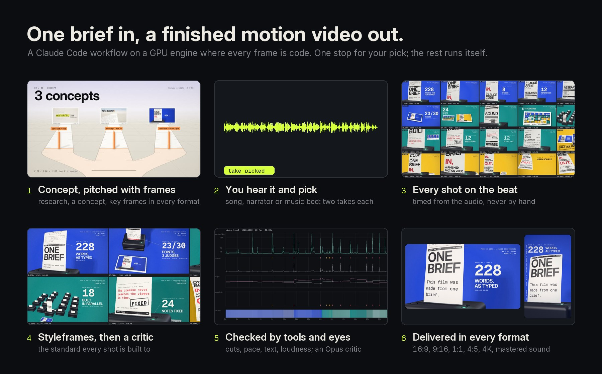
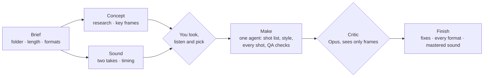

<div align="center">

# motion-studio

**One brief in, a finished motion video out.**
A Claude Code workflow that researches, pitches, times, builds, checks and delivers motion videos,
on a GPU engine where every frame is code.



[](WORKFLOW.md)
[](https://www.anthropic.com/claude)
[](LICENSE)


[](docs/motion-studio-guide.pdf)

**New here? Read [the guide (PDF, 12 pages)](docs/motion-studio-guide.pdf):** how the pipeline works, how to brief it,
what to answer at the stop, what you get, and how to change it.

</div>

## How it works

You write a brief ("a 30-second launch film for our app, in our brand, 16:9 and 9:16"). Claude Code
runs `.claude/workflows/motion-video.js`. By default it works **direct**: one stop for your decision,
and one agent makes the film the way a single motion designer would, because for a short film that is
faster and cheaper than splitting the work across many agents.



| Preset | Agents | When |
| --- | --- | --- |
| `direct` (default) | 6: setup, concept and sound at the same time, one maker, one critic, one finishing pass | films up to about a minute |
| `lean` | about 12: a planner, a look stage with hero shots, shot builders working in parallel, a review round | long films with many shots |
| `full` | 30+: three concepts and a judge panel, a drawn storyboard with a critic, a builder, reviewer and fixer per shot, up to three review rounds | when a film is worth everything |

Details: [WORKFLOW.md](WORKFLOW.md).

## Why the results hold up

- **You decide before anything is built.** The run stops once: you see the concept's key frames and hear
  the audio takes (a song, a music bed, or narrator voices) and pick. Nothing is made on audio you haven't
  heard.
- **A written quality bar.** Every agent reads [`motion-craft`](.claude/skills/motion-craft/SKILL.md):
  type scale, motion timing and easing, composition, the social hook, and what never ships
  (placeholder art, default fonts, PowerPoint motion).
- **Independent eyes.** A critic agent on Opus that has not seen the code judges the film from its frames.
- **Measurements, not only opinions.** `qa.py` finds cuts nobody placed and stretches too fast to
  follow (optical flow); `audit.mjs` checks every piece of text for safe area, size, overlaps and
  reading time; loudness is mastered to -14 LUFS / -1 dBTP.
- **Truth on screen.** Every fact, number and handle is checked at its source and written in the brief.
- **Generated media is a base, not the result.** Runway stills and clips are redrawn in code
  (ink, painterly, riso, halftone, dither) and animated with rigs and JS overlays.

## What a run leaves behind

From the first long film made with it: the three concept pitches the judges scored, the storyboard
sheet timed to the audio, the styleframes the shots were built to, the preview player, and the QA curves
of the finished cut.


| Storyboard, timed to the audio | Styleframes, after the critics |
| --- | --- |
|  |  |

| The preview player: scrub, beat and edit marks, formats, safe areas, notes | `qa.py` on the final cut: motion, cuts, light, colour |
| --- | --- |
|  |  |

## What it costs

Measure any run with `python studio/tools/runcost.py <run id>`: agents, tokens, dollars at API prices
and hours per stage.

The first long film (48 s) ran the full path: 46 agents, about 17 hours and about $320 of usage at API
prices. Nearly all of that was agents re-reading their own context: every agent starts by loading the
studio and the film, and a builder that keeps looking at its renders grows to 300-500K tokens and
re-reads them on every step. That is why the default is now direct (six agents), why documents are capped
(brief 6 KB, concept 5 KB, shot table 12 KB), why every maker has a budget (about three render-and-look
passes), and why makers run on Sonnet while only the critics run on Opus.

## The engine

Every frame is a pure function of time, drawn with WebGL2 in headless Chrome and piped to ffmpeg
as raw pixels (about 80 ms a frame at 1080p with 12-sample motion blur on a laptop GPU).

- **Layers**: shaders, Canvas 2D, images on a bendable mesh, 3D cards, image sequences (generated
  video), Three.js scenes, groups with masks, transforms and their own looks.
- **Looks**: grade, tritone, halftone, riso, dither (PC-98 palettes), CRT, paper, ink (XDoG line art),
  kuwahara, chroma, glitch slices, pixelate, posterize, lens, grain, vignette, bloom.
- **Type**: kinetic words and letters, typewriter, odometer, slot roller, text on paths, stamps, lyric
  captions (box, karaoke, pop, kinetic), each piece of text audited.
- **Time**: beat grids from a BPM or a song's detected beats, an edit with 11 transition types, cues
  for the sound. Hard cuts are decided per frame, so no frame blends two shots.
- **Rig** for still art: breathing, sway, beat bounce, blinks, a mouth that follows timed lyrics,
  parallax plates, camera shake.
- **3D**: Three.js with extruded type from any TTF, extruded SVG logos, glTF, chrome, glass, clay.
- **Formats**: 16:9, 9:16, 1:1, 4:5 and 4K from one timeline, each laid out on its own; platform safe
  areas for Reels, TikTok and Shorts.
- **Sound**: numpy synthesis (pads, plucks, FM bells, drums, whooshes, risers), a mixer with sends and
  ducking, designed effects on every cut and hit, song analysis (beats, bars, sections, word timing
  with faster-whisper).
- **Preview player**: real-time playback, scrubbing with beat and edit marks, format switch, safe-area
  overlay, and notes typed at a timestamp that land in the film's `notes.md` for the next run.

## Quick start

Requirements: [Claude Code](https://claude.com/claude-code), Node 22+, Python 3.11+, ffmpeg on the PATH,
Google Chrome (or set `CHROME` to a Chromium). Optional: the Runway MCP connector for generated art,
songs and voice.

```bash
git clone https://github.com/winchxyz/motion-studio && cd motion-studio
npm install
pip install -r requirements.txt
```

Open Claude Code in the folder and say:

> Run the motion-video workflow: a 30-second launch film for <product>, their brand, 16:9 and 9:16.

Watch it with `/workflows`. It stops once, after the concept and the sound: look at the key frames,
listen to the takes, say which, and it runs to delivery. Ask for `preset: "lean"` on a long film with
many shots. [The guide](docs/motion-studio-guide.pdf) walks through a whole film, with example briefs
and answers. Everything also works by hand:

```bash
node studio/tools/new-film.mjs my-film --template spot         # or music-video
node studio/tools/serve.mjs                                     # preview at /studio/engine/preview.html?film=/my-film
node studio/tools/render.mjs my-film --sheet 0:30:0.5 --cols 8 --tw 320
node studio/tools/render.mjs my-film --video --format h
node studio/tools/deliver.mjs my-film
python studio/tools/qa.py my-film --format h
```

## What's inside

```
.claude/
  workflows/motion-video.js    the orchestration (direct, lean and full presets, the approval stop,
                               model tiers, budgets, credit cap, resume)
  skills/motion-*/SKILL.md     film, brief, song, storyboard, art, build, review, deliver, reference, craft
  agents/motion-critic.md      the reviewer that only sees frames
  settings.json                a hook that syntax-checks every edited JS file
studio/
  engine/    compositor, looks, shaders, type, draw, timeline, formats, rig, captions, 3D, player
  tools/     render, deliver, serve, new-film, song, breakdown, qa, audit, frames, seq, fetch, fonts, runcost
  audio/     synth, mixer, cue effects, mixdown
  templates/ music-video, spot  (style.js + one file per shot)
  fonts/     Inter, Geist Mono, Newsreader, Instrument Serif (OFL)
styles/      style cards the concept stage draws from
docs/        the guide (PDF) and the pictures in this README
_lab/        engine tests
```

## Credits

Built by [@winchxyz](https://github.com/winchxyz) with Claude Code. Claude Opus 5.5 wrote the engine,
the tools and the workflow; when it runs, Sonnet 5.5 makes and Opus 5.5 judges.
Fonts under the SIL Open Font License. Code under the [MIT License](LICENSE).
